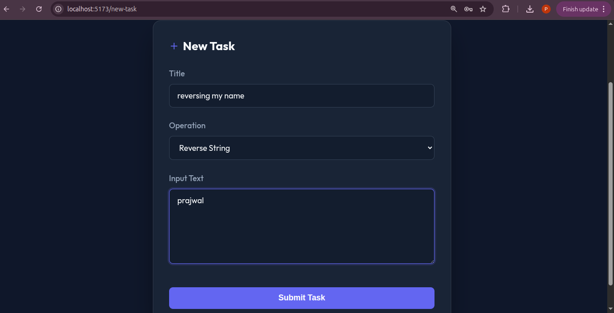
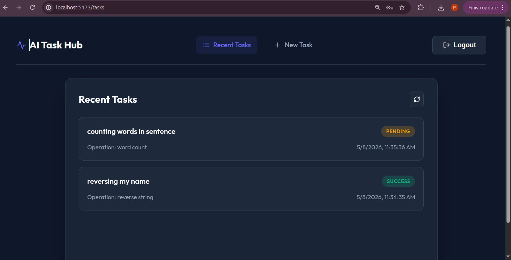
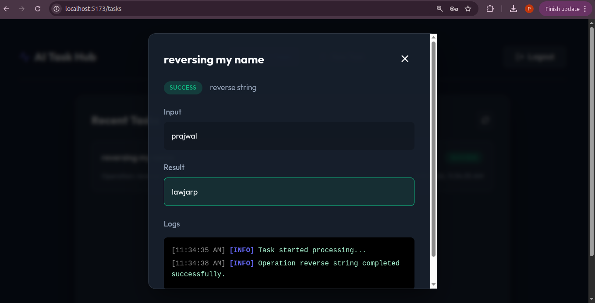

# AI Task Processing Platform

A full-stack microservices application for asynchronous task processing. Users submit text tasks via a React UI; a Node.js API queues them in Redis; Python workers process them in the background and write results to MongoDB.

[](https://github.com/AppaniPrajwal/ai-task-processing/actions/workflows/ci.yml)

---

## Architecture

```
Frontend (React) → nginx → Backend API (Node.js) → Redis Queue → Worker (Python) → MongoDB
```

GitHub Actions builds Docker images on every push → Argo CD syncs them to Kubernetes automatically.

See [Architecture.md](./Architecture.md) for the full flow diagram and design decisions.

---

## Features

- **JWT Authentication** — Register, login, bcrypt-hashed passwords
- **Task Queue** — Redis `BRPOP` ensures each task is processed exactly once
- **Async Processing** — 4 text operations: uppercase, lowercase, reverse, word count
- **Live Status Tracking** — Frontend polls every 3 s; shows pending → running → success/failed
- **Structured Logs** — Per-task timestamped log entries stored in MongoDB
- **GitOps CD** — Argo CD watches the infra repo and auto-deploys on image tag changes

---

## Project Structure

```
AI-Task-Processing/
├── frontend/          # React + Vite app
├── backend/           # Node.js + Express API
├── worker/            # Python task processor
├── nginx.conf         # Local dev nginx proxy (mirrors K8s ingress)
├── docker-compose.yml # Local dev stack
├── .github/workflows/ # GitHub Actions CI/CD
└── Architecture.md    # System design doc

infra/
└── kubernetes/        # K8s manifests (GitOps)
    ├── namespace.yaml
    ├── secrets.yaml
    ├── configmap.yaml
    ├── backend.yaml
    ├── worker.yaml
    ├── frontend.yaml
    ├── redis.yaml
    ├── mongodb.yaml
    ├── ingress.yaml
    └── application.yaml  ← Argo CD Application
```

---

## Local Development Setup

### Prerequisites

Install:

- Node.js
- npm
- Docker
- Docker Compose
- MongoDB Atlas account (or local MongoDB)

---

### 1. Clone Repository

```bash
git clone <repository>
cd AI-Task-Processing
```

---

### 2. Backend Environment Setup

Create `backend/.env` and add:

```env
MONGO_URI=your_mongodb_uri
JWT_SECRET=your_jwt_secret
REDIS_URL=redis://localhost:6379
PORT=5000
```

---

### 3. Worker Environment Setup

Create `worker/.env` and add:

```env
MONGO_URI=your_mongodb_uri
REDIS_URL=redis://localhost:6379
```

---

### 4. Frontend Environment Setup

Create `frontend/.env.development` and add:

```env
VITE_API_URL=http://localhost:5000/api
```

---

### 5. Start Redis

Using Docker:

```bash
docker run -d -p 6379:6379 redis
```

---

### 6. Start Backend

```bash
cd backend
npm install
npm run dev
```

---

### 7. Start Frontend

Open a new terminal:

```bash
cd frontend
npm install
npm run dev
```

---

### 8. Start Worker

Open another terminal:

```bash
cd worker
pip install -r requirements.txt
python worker.py
```

---

### 9. Verify Application

- ✅ Register works
- ✅ Login works
- ✅ Task creation works
- ✅ Worker processing works

---

## Docker Compose Setup

Start entire stack:

```bash
docker-compose up --build
```

Stop containers:

```bash
docker-compose down
```

> The Docker Compose setup uses an nginx container (matching the K8s ingress) to proxy `/api → backend:5000` and `/` → `frontend:3000`. Access the app at **http://localhost:8080**.

---

## Kubernetes + Argo CD Deployment Setup

### Prerequisites

Install:

- Docker
- kubectl
- Minikube
- Argo CD CLI (optional)

---

### 1. Start Minikube

```bash
minikube start
```

---

### 2. Enable Ingress

```bash
minikube addons enable ingress
```

---

### 3. Verify Cluster

```bash
kubectl get nodes
```

---

### 4. Clone Infrastructure Repository

```bash
git clone <infra-repository>
cd infra
```

---

### 5. Create Namespace

```bash
kubectl create namespace ai-task-platform
```

---

### 6. Create Kubernetes Secrets

```bash
kubectl create secret generic app-secrets \
  --from-literal=jwt-secret="your_jwt_secret" \
  --from-literal=mongo-uri="your_mongodb_uri" \
  -n ai-task-platform
```

---

### 7. Apply Kubernetes Manifests

```bash
kubectl apply -f kubernetes/
```

---

### 8. Verify Pods

```bash
kubectl get pods -n ai-task-platform
```

Ensure all pods are:

- ✅ Running
- ✅ Ready

---

### 9. Install Argo CD

```bash
kubectl create namespace argocd
```

```bash
kubectl apply -n argocd -f https://raw.githubusercontent.com/argoproj/argo-cd/stable/manifests/install.yaml
```

---

### 10. Verify Argo CD Pods

```bash
kubectl get pods -n argocd
```

---

### 11. Access Argo CD

Start port forwarding:

```bash
kubectl port-forward svc/argocd-server -n argocd 8080:443
```

---

### 12. Get Argo CD Admin Password

```bash
kubectl get secret argocd-initial-admin-secret -n argocd -o jsonpath="{.data.password}" | base64 -d
```

Username: `admin`

---

### 13. Deploy Argo CD Application

```bash
kubectl apply -f application.yaml
```

---

### 14. Verify GitOps Sync

```bash
kubectl get applications -n argocd
```

---

### 15. Verify Deployment Health

```bash
kubectl get pods -n ai-task-platform
```

---

### 16. Restart Deployments (If Needed)

```bash
kubectl rollout restart deployment backend -n ai-task-platform
```

```bash
kubectl rollout restart deployment frontend -n ai-task-platform
```

```bash
kubectl rollout restart deployment worker -n ai-task-platform
```

---

### 17. Check Logs

Backend:

```bash
kubectl logs deployment/backend -n ai-task-platform
```

Worker:

```bash
kubectl logs deployment/worker -n ai-task-platform
```

---

### 18. Verify Final System

- ✅ Authentication works
- ✅ Task creation works
- ✅ Worker processing works
- ✅ Redis queue works
- ✅ Argo CD sync healthy
- ✅ CI/CD pipeline updates deployments automatically

---

## CI/CD Flow

1. Push to `main` → GitHub Actions triggers
2. ESLint runs on the frontend
3. Docker images built and pushed to Docker Hub tagged with the commit SHA
4. Image tags in `infra/kubernetes/` manifests are patched via `sed`
5. Change committed back to the infra repo
6. Argo CD detects the new commit and performs a rolling update

---

## Environment Variables

| File | Variable | Description |
|---|---|---|
| `backend/.env` | `MONGO_URI` | MongoDB connection string |
| `backend/.env` | `JWT_SECRET` | JWT signing secret |
| `backend/.env` | `PORT` | Express port (default 5000) |
| `worker/.env` | `MONGO_URI` | MongoDB connection string |
| `worker/.env` | `REDIS_URL` | Redis URL |
| `frontend/.env.development` | `VITE_API_URL` | Backend API URL for local dev |

See `.env.example` files in each service directory for templates.

---

## Screenshots

### Argo CD — Synced Deployment

<!-- Add screenshot here -->


### Kubernetes Pods Running

<!-- Add screenshot here -->


### Task Creation

<!-- Add screenshot here -->


### Worker Processing & Results

<!-- Add screenshot here -->


### Task Logs

<!-- Add screenshot here -->


---

## Tech Stack

| Layer | Technology |
|---|---|
| Frontend | React 18, Vite, custom CSS |
| Backend | Node.js 20, Express, Mongoose, JWT, bcrypt |
| Worker | Python 3.12, redis-py, pymongo |
| Database | MongoDB Atlas |
| Queue | Redis |
| Container | Docker |
| Orchestration | Kubernetes |
| CD | Argo CD |
| CI | GitHub Actions |
